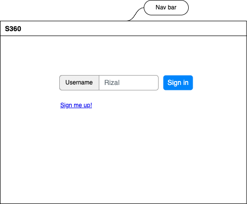
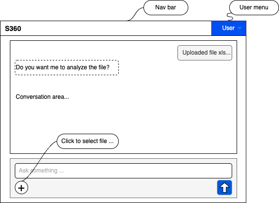
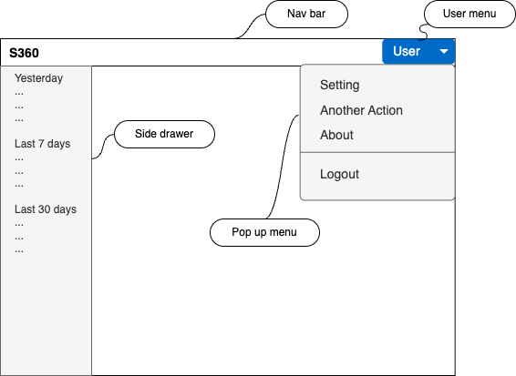

---

marp: true
author: "thuleen"
paginate: true
date: dd MMMM YYYY
notes: 
# Based on "User Story, UI_UX D360 Playground.pdf"
header: "S360 pre-alpha web app development for Dataplay."
footer: "Azlan Abdul Aziz (azlan.thuleen@gmail.com)"

---

# Milestones

🎯 **M1** Planning/designing UI/UX and core development 
🎯 **M2** Testing, improvement core feature
🎯 **M3** Further refinement / additional features

<!--

NOTES: 

👉 Removed task deployment in M3 - not relevant for time being.

👉 Project duration 12 weeks - 4 sessions - 2hour each session 

👉 Thuleen will call for discussion - if requires, twice a week for progress update.

️👉 To deploy "a working web app" in 14 days but will be far from ideal

👉 Deployment not relevant as S360 still in development 

 -->

---

# M1 deliverables 🤝📦 

**Web application** (refer to proposed UI/UX): 
1. Compatible with Google Chrome;
2. Hosted at https://dataplay.ddns.net; 
3. Ready to connect to the backend REST-API, Ethereum network and AI services; 

<!-- 

NOTES:

👉 M1 basically to come up with a web app that resembles S360 main idea.

👉 Challenge since to link with endpoints and not enough time to test as we want expose to external parties.

👉 Doable but the end result of 14 days of worth of development will be far from perfect!

--->

---

# Proposed UI/UX

A **homage** to _ChatGPT_ but tune to user story: 

> Farah, a school teacher uses S360 to understand the different individual profile and categorise them by competency of her students based on the submitted PDF/CSV/Excel files.

<!-- 
NOTES:

👉 Reqeust permission from Dataplay (client) so that we can have some freedom to design UXUI -as the team do not have a clear direction and demand a short development time?!.

👉 For now settle for the "Farah user story". However request to drop for the PDF support for the time being. ie. This version.

--->

---

# Development style 🏗️

 - Smaller iterations to adapt evolving requirements.
    - 7days ⤏; 3days; 3days sprints.
 - Start with proposed UI (next slide)

<!-- 

NOTES:

👉 Start with proposed UI in the next 7 days to scaffold first iteration and establish pattern to interface with backend services (SNAD-API and AI).

--->

---

# Login

<!-- 

NOTES:

👉 For the time being, a simple login (just username and no password) so we can focus the development on the core functionality of the app.

👉 At least the login page emphasis on the idea that the app is capable of role-based-access-control ("RBAC"). User association to an organization/school/department. 

--->

------

# Main (analytic) area

<!-- 

NOTES:

👉 Page which user will spend most of the time while using the app.

👉 Homage to ChatGPT.

👉 Able to guide user to set of questions related to S360 main concept?

--->

---

#  Side drawer

<!-- 

NOTES:

👉 Optional feature where user can browse conversation history.

--->

---

# Pre-alpha release 🚀

- Similar ChatGPT UX;
  Generated response related to uploaded student files and user queries.
- Simple, iterate, pivot quickly to demonstrate S360 value proposition;

<!-- 

NOTES:

👉 Pre-alpha (14 days dev) means first internal release & testing, very unstable, missing features and buggy. 

👉 We have configured/comissioned hyperledger network and SNAD-API (REST-API). Previously thuleen is not expected to develop the UI. So client must understood that thuleen is expected to develop an web app not just an API!

👉 However, this is already considered as reflected in the latest/submitted quotation. 

👉 Now a frontend but to link with the SNAD-API and AI endpoints.

👉 Frontend dev does not meant just front end but also changes in the SNAD-API to suit UX.

--->